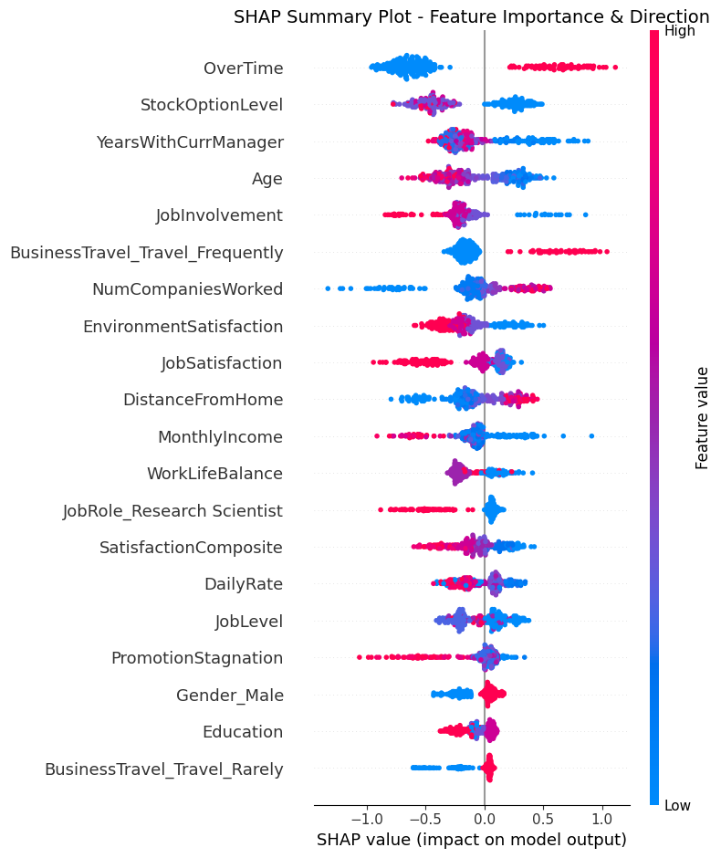

```python
# notebooks/03_Modeling.ipynb
import pandas as pd
import numpy as np
import shap
import matplotlib.pyplot as plt
import sys
import os

# Add src to path
sys.path.append(os.path.abspath(os.path.join('..')))

from src.modeling import (load_processed_data, apply_smote, train_logistic_regression, 
                          train_xgboost, evaluate_model, get_shap_values)

# Visual settings
plt.rcParams["figure.figsize"] = (10, 6)

```


```python
# 1. Load Processed Data
X_train, y_train, X_test, y_test = load_processed_data('../data/processed')
print(f"Train Shape: {X_train.shape}, Test Shape: {X_test.shape}")
print(f"Train Class Distribution:\n{y_train.value_counts(normalize=True)}")

```

    Train Shape: (1176, 48), Test Shape: (294, 48)
    Train Class Distribution:
    Attrition
    0    0.838435
    1    0.161565
    Name: proportion, dtype: float64
    


```python
# 2. Baseline: Logistic Regression (Class Weight Balanced)
lr_model = train_logistic_regression(X_train, y_train, class_weight='balanced')
evaluate_model(lr_model, X_test, y_test, model_name="Logistic Regression")

```

    --- Logistic Regression Evaluation ---
    Recall: 0.6170
    F1 Score: 0.4603
    
    Classification Report:
                  precision    recall  f1-score   support
    
               0       0.92      0.80      0.85       247
               1       0.37      0.62      0.46        47
    
        accuracy                           0.77       294
       macro avg       0.64      0.71      0.66       294
    weighted avg       0.83      0.77      0.79       294
    
    Confusion Matrix:
    [[197  50]
     [ 18  29]]
    


    {'recall': 0.6170212765957447, 'f1': 0.4603174603174603}


```python
# 3. Handling Imbalance: SMOTE
X_train_smote, y_train_smote = apply_smote(X_train, y_train)
print(f"Shape after SMOTE: {X_train_smote.shape}")
print(f"Class Distribution after SMOTE:\n{y_train_smote.value_counts(normalize=True)}")

```

    Shape after SMOTE: (1972, 48)
    Class Distribution after SMOTE:
    Attrition
    0    0.5
    1    0.5
    Name: proportion, dtype: float64
    


```python
# 4. Advanced Model: XGBoost on SMOTE Data
xgb_model = train_xgboost(X_train_smote, y_train_smote)
evaluate_model(xgb_model, X_test, y_test, model_name="XGBoost (with SMOTE)")

```

    --- XGBoost (with SMOTE) Evaluation ---
    Recall: 0.3404
    F1 Score: 0.4444
    
    Classification Report:
                  precision    recall  f1-score   support
    
               0       0.88      0.96      0.92       247
               1       0.64      0.34      0.44        47
    
        accuracy                           0.86       294
       macro avg       0.76      0.65      0.68       294
    weighted avg       0.85      0.86      0.85       294
    
    Confusion Matrix:
    [[238   9]
     [ 31  16]]
    

    C:\Users\19803\business\ForgeLaunch\ForgeLaunchDataScienceJan30Spring2026\venv\Lib\site-packages\xgboost\training.py:199: UserWarning: [16:43:42] WARNING: C:\actions-runner\_work\xgboost\xgboost\src\learner.cc:790: 
    Parameters: { "use_label_encoder" } are not used.
    
      bst.update(dtrain, iteration=i, fobj=obj)
    


    {'recall': 0.3404255319148936, 'f1': 0.4444444444444444}


```python
# 5. Interpretation: SHAP Values
# We explain the XGBoost model using the Test set (or a sample of it)
explainer, shap_values = get_shap_values(xgb_model, X_test)

# Summary Plot
plt.figure()
shap.summary_plot(shap_values, X_test, show=False)
plt.title("SHAP Summary Plot - Feature Importance & Direction", fontsize=14)
plt.tight_layout()
plt.show()

# Validating the "OverTime" hypothesis
try:
    if 'OverTime_1' in X_test.columns: # If One-Hot encoded, it might be OverTime_1 or OverTime_Yes
        print("Checking OverTime feature importance...")
    else:
        # Check columns
        print("Columns:", X_test.columns.tolist())
except Exception as e:
    print(e)

```


    

    


    Columns: ['Age', 'DailyRate', 'DistanceFromHome', 'Education', 'EnvironmentSatisfaction', 'HourlyRate', 'JobInvolvement', 'JobLevel', 'JobSatisfaction', 'MonthlyIncome', 'MonthlyRate', 'NumCompaniesWorked', 'OverTime', 'PercentSalaryHike', 'PerformanceRating', 'RelationshipSatisfaction', 'StockOptionLevel', 'TotalWorkingYears', 'TrainingTimesLastYear', 'WorkLifeBalance', 'YearsAtCompany', 'YearsInCurrentRole', 'YearsSinceLastPromotion', 'YearsWithCurrManager', 'TenureRatio', 'PromotionStagnation', 'IncomeStability', 'SatisfactionComposite', 'Department_Research & Development', 'Department_Sales', 'JobRole_Human Resources', 'JobRole_Laboratory Technician', 'JobRole_Manager', 'JobRole_Manufacturing Director', 'JobRole_Research Director', 'JobRole_Research Scientist', 'JobRole_Sales Executive', 'JobRole_Sales Representative', 'MaritalStatus_Married', 'MaritalStatus_Single', 'EducationField_Life Sciences', 'EducationField_Marketing', 'EducationField_Medical', 'EducationField_Other', 'EducationField_Technical Degree', 'Gender_Male', 'BusinessTravel_Travel_Frequently', 'BusinessTravel_Travel_Rarely']
    
